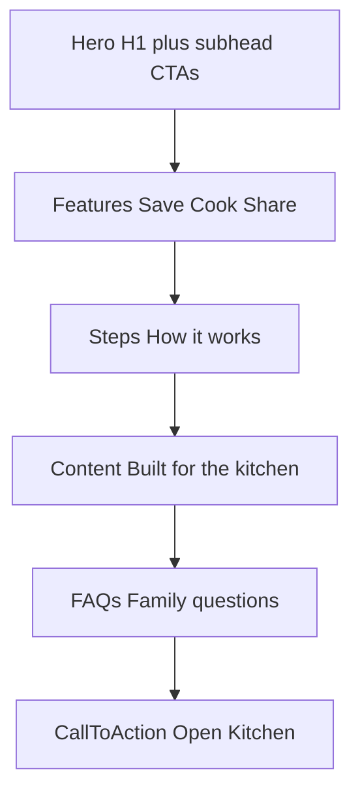

# Love the Laus Full Landing Page Implementation Plan

> **For agentic workers:** REQUIRED SUB-SKILL: Use superpowers:subagent-driven-development (recommended) or superpowers:executing-plans to implement task-by-task. Steps use checkbox (`- [ ]`) syntax for tracking.

**Goal:** Ship a complete marketing landing page for Love the Laus that explains the family recipe product and links to Kitchen, while removing AstroWind template/demo cruft from the repo.

**Architecture:** Keep Astro v7 at repo root as a **static marketing site only** ([`src/pages/index.astro`](src/pages/index.astro)). Reuse existing AstroWind widgets (Hero, Features, Steps, Content, FAQs, CallToAction) with Love-the-Laus copy. Kitchen remains the product in [`kitchen/`](kitchen/) (Next.js). CTA URLs come from `PUBLIC_KITCHEN_URL`.

**Tech Stack:** Astro v7, Tailwind CSS v4, existing widget components, `import.meta.env.PUBLIC_KITCHEN_URL`, Kitchen Next.js app (unchanged).

**Plan file on execute:** Also save this plan to [`docs/superpowers/plans/2026-09-01-full-landing-page.md`](docs/superpowers/plans/2026-09-01-full-landing-page.md).

## Global Constraints

- Do **not** edit [`kitchen/`](kitchen/) product logic unless a broken link requires a env doc tweak.
- Do **not** edit the attached `.cursor/plans/*.plan.md` files.
- Headline (H1) stays: **"Family recipes that never disappear"**.
- Subhead (hero subtitle) must be **rewritten** (see copy below).
- Delete demo routes (user chose aggressive cleanup); keep **home + privacy + terms + 404** only.
- `PUBLIC_KITCHEN_URL` defaults to `http://localhost:3000` in dev.
- No fake testimonials or competitor name-drops on the page.
- Run `npm run build` and `npm run check` at repo root before done.

---

## Copy (locked for implementation)

| Element | Text |
|---------|------|
| **H1 (headline)** | Family recipes that never disappear |
| **Subhead (new)** | The recipe box your family actually uses — save from anywhere, cook on iPhone or iPad, share cookbooks with a link, and export everything if you ever leave. |
| **Primary CTA** | Open Kitchen |
| **Secondary CTA** | See how it works → `#how-it-works` |

---

## Page structure (full landing)



**Section IDs for nav:** `#features`, `#how-it-works`, `#kitchen`, `#faq`

---

## File map

| Action | Path | Responsibility |
|--------|------|----------------|
| Rewrite | [`src/pages/index.astro`](src/pages/index.astro) | Full landing composition |
| Modify | [`src/navigation.ts`](src/navigation.ts) | Anchor nav + Open Kitchen CTA |
| Modify | [`src/config.yaml`](src/config.yaml) | Branding, disable blog, OG description |
| Modify | [`src/components/Logo.astro`](src/components/Logo.astro) | Remove rocket emoji |
| Modify | [`src/layouts/PageLayout.astro`](src/layouts/PageLayout.astro) | Drop RSS feed from header |
| Modify | [`.env.example`](.env.example) | Document `PUBLIC_KITCHEN_URL` |
| Rewrite | [`README.md`](README.md) | Love the Laus + two-app layout |
| Delete | `src/pages/homes/**`, `src/pages/landing/**`, `src/pages/[...blog]/**` | Template demos |
| Delete | `src/pages/about.astro`, `services.astro`, `pricing.astro`, `contact.astro` | Template pages |
| Delete | `src/pages/rss.xml.ts`, `src/data/post/**` | Blog/RSS |
| Modify | [`src/content.config.ts`](src/content.config.ts) | Remove `post` collection |
| Prune | [`src/navigation.ts`](src/navigation.ts) imports | Remove unused blog permalink imports |
| Optional prune | `src/components/blog/**`, blog widgets | Only if `npm run check` passes after deletion |

---

### Task 1: Remove AstroWind demo and blog surface

**Files:**
- Delete: `src/pages/homes/**`, `src/pages/landing/**`, `src/pages/[...blog]/**`
- Delete: `src/pages/about.astro`, `src/pages/services.astro`, `src/pages/pricing.astro`, `src/pages/contact.astro`, `src/pages/rss.xml.ts`
- Delete: `src/data/post/**`
- Modify: [`src/content.config.ts`](src/content.config.ts)
- Modify: [`src/config.yaml`](src/config.yaml) — set `apps.blog.isEnabled: false`

**Interfaces:**
- Produces: repo with only routable marketing pages: `/`, `/privacy`, `/terms`, `/404`

- [ ] **Step 1:** Delete demo page directories and blog posts listed above.

- [ ] **Step 2:** Replace [`src/content.config.ts`](src/content.config.ts) with empty collections:

```typescript
import { defineCollection } from 'astro:content';

export const collections = {};
```

- [ ] **Step 3:** In [`src/config.yaml`](src/config.yaml), set `apps.blog.isEnabled: false` (leave nested keys or remove block — either is fine if build passes).

- [ ] **Step 4:** Run build to catch broken imports:

```bash
cd /Users/plau/Projects/lovethelaus && npm run build
```

Expected: PASS with ~4 pages (index, privacy, terms, 404).

- [ ] **Step 5:** Commit: `chore: remove AstroWind demo and blog routes`

---

### Task 2: Site chrome — logo, header, layout, env

**Files:**
- Modify: [`src/components/Logo.astro`](src/components/Logo.astro)
- Modify: [`src/layouts/PageLayout.astro`](src/layouts/PageLayout.astro)
- Modify: [`src/navigation.ts`](src/navigation.ts)
- Create: [`.env.example`](.env.example) (root)

**Interfaces:**
- Produces: `kitchenUrl` constant pattern: `import.meta.env.PUBLIC_KITCHEN_URL ?? 'http://localhost:3000'`

- [ ] **Step 1:** Update Logo — remove emoji, keep site name from config:

```astro
<span class="self-center ml-2 rtl:ml-0 rtl:mr-2 text-2xl md:text-xl font-bold text-gray-900 whitespace-nowrap dark:text-white">
  {SITE?.name}
</span>
```

- [ ] **Step 2:** In [`src/layouts/PageLayout.astro`](src/layouts/PageLayout.astro), change header to `showRssFeed={false}` (or remove prop).

- [ ] **Step 3:** Expand [`src/navigation.ts`](src/navigation.ts):

```typescript
import { getPermalink } from './utils/permalinks';

const kitchenUrl = import.meta.env.PUBLIC_KITCHEN_URL ?? 'http://localhost:3000';

export const headerData = {
  links: [
    { text: 'Home', href: getPermalink('/') },
    { text: 'Features', href: getPermalink('/#features') },
    { text: 'How it works', href: getPermalink('/#how-it-works') },
    { text: 'FAQ', href: getPermalink('/#faq') },
  ],
  actions: [{ text: 'Open Kitchen', href: kitchenUrl, target: '_blank' }],
};

export const footerData = {
  links: [],
  secondaryLinks: [
    { text: 'Terms', href: getPermalink('/terms') },
    { text: 'Privacy Policy', href: getPermalink('/privacy') },
  ],
  socialLinks: [],
  footNote: 'Love the Laus · Family recipes, yours to keep.',
};
```

- [ ] **Step 4:** Add root [`.env.example`](.env.example):

```env
PUBLIC_KITCHEN_URL=http://localhost:3000
```

- [ ] **Step 5:** Commit: `chore: Love the Laus site chrome and nav`

---

### Task 3: Full landing page content

**Files:**
- Modify: [`src/pages/index.astro`](src/pages/index.astro) (full rewrite)

**Interfaces:**
- Consumes: `kitchenUrl`, existing widgets Hero, Features, Steps, Content, FAQs, CallToAction

- [ ] **Step 1:** Replace [`src/pages/index.astro`](src/pages/index.astro) with full section stack. Core structure:

```astro
---
import Layout from '~/layouts/PageLayout.astro';
import Hero from '~/components/widgets/Hero.astro';
import Features from '~/components/widgets/Features.astro';
import Steps from '~/components/widgets/Steps.astro';
import Content from '~/components/widgets/Content.astro';
import FAQs from '~/components/widgets/FAQs.astro';
import CallToAction from '~/components/widgets/CallToAction.astro';

const kitchenUrl = import.meta.env.PUBLIC_KITCHEN_URL ?? 'http://localhost:3000';

const metadata = {
  title: 'Love the Laus — family recipes',
  description:
    'Family recipes that never disappear. Save, cook on iPhone or iPad, share cookbooks, export anytime.',
  ignoreTitleTemplate: true,
};
---

<Layout metadata={metadata}>
  <!-- Hero: H1 + NEW subhead -->
  <Hero actions={[...]}>
    <Fragment slot="title">Family recipes that <span class="text-accent dark:text-white">never disappear</span></Fragment>
    <Fragment slot="subtitle">The recipe box your family actually uses — save from anywhere, cook on iPhone or iPad, share cookbooks with a link, and export everything if you ever leave.</Fragment>
  </Hero>

  <Features id="features" ... />  <!-- Save / Cook / Share (expand copy) -->

  <Steps id="how-it-works" title="How it works" items={[
    { title: 'Add recipes', description: 'Type them in, paste a food-blog link, or import from social — then fix the draft.', icon: 'tabler:plus' },
    { title: 'Cook from the kitchen', description: 'Open cook mode on phone or iPad: big type, check off ingredients, screen stays awake.', icon: 'tabler:chef-hat' },
    { title: 'Share the cookbook', description: 'Invite family by link. They can leave notes without changing your recipe.', icon: 'tabler:link' },
  ]} />

  <Content id="kitchen" title="Built for the kitchen" ... />  <!-- iPad/phone, export, no ads bullets -->

  <FAQs id="faq" title="Questions families ask" items={[...]} />  <!-- 4–6 real FAQs: export, offline, TikTok import, privacy -->

  <CallToAction actions={[{ variant: 'primary', text: 'Open Kitchen', href: kitchenUrl, target: '_blank' }]} ... />
</Layout>
```

Fill in full `items` arrays for Features, Content, FAQs, and CallToAction subtitle in implementation (no lorem ipsum).

- [ ] **Step 2:** Update [`src/config.yaml`](src/config.yaml) metadata description to match new subhead.

- [ ] **Step 3:** Visual pass — hero without generic AstroWind hero image (text-first is fine; optional warm gradient via Hero `bg` slot if needed).

- [ ] **Step 4:** Commit: `feat: full Love the Laus landing page`

---

### Task 4: Docs and dead-code prune

**Files:**
- Rewrite: [`README.md`](README.md)
- Update: [`AGENTS.md`](AGENTS.md) — clarify marketing site vs kitchen/
- Prune: unused blog imports in [`src/utils/blog.ts`](src/utils/blog.ts) callers only if build/check fails

- [ ] **Step 1:** Rewrite root README:

```markdown
# Love the Laus

Marketing site (Astro, this folder) + recipe app ([kitchen/](kitchen/)).

## Marketing site
npm run dev   # http://localhost:4321
PUBLIC_KITCHEN_URL=http://localhost:3000

## Kitchen app
cd kitchen && npm run dev   # http://localhost:3000
```

- [ ] **Step 2:** If `npm run check` fails on dead blog utils, remove unused blog component imports or files — do not refactor vendor integration.

- [ ] **Step 3:** Commit: `docs: Love the Laus README and agent notes`

---

### Task 5: Verification

- [ ] **Step 1:** Build marketing site:

```bash
cd /Users/plau/Projects/lovethelaus && npm run build && npm run check
```

Expected: PASS; `dist/index.html` contains new subhead and section anchors.

- [ ] **Step 2:** Grep dist for removed template strings:

```bash
grep -c "AstroWind" dist/index.html || true
```

Expected: 0 in body copy (site name only in meta if anywhere).

- [ ] **Step 3:** Start Kitchen for manual CTA test (optional):

```bash
cd kitchen && npm run dev
```

Open `http://localhost:4321` (if running Astro dev) or inspect `dist/index.html` — **Open Kitchen** links to `PUBLIC_KITCHEN_URL`.

- [ ] **Step 4:** Commit any fixups: `chore: landing page verification fixes`

---

## Self-review (spec coverage)

| Requirement | Task |
|-------------|------|
| Full landing (not minimal Hero+Features) | Task 3 |
| Change subhead | Task 3 copy |
| Keep headline | Task 3 |
| Delete AstroWind demos | Task 1 |
| Kitchen unchanged | Global constraint |
| Nav + CTA to Kitchen | Task 2 |
| No blog/RSS noise | Task 1 + Task 2 |

## Execution handoff

**Plan complete.** On confirm, save to `docs/superpowers/plans/2026-09-01-full-landing-page.md` and implement.

**Two execution options:**

1. **Subagent-Driven (recommended)** — fresh subagent per task, review between tasks
2. **Inline Execution** — implement all tasks in this session with checkpoints

Which approach do you want?
